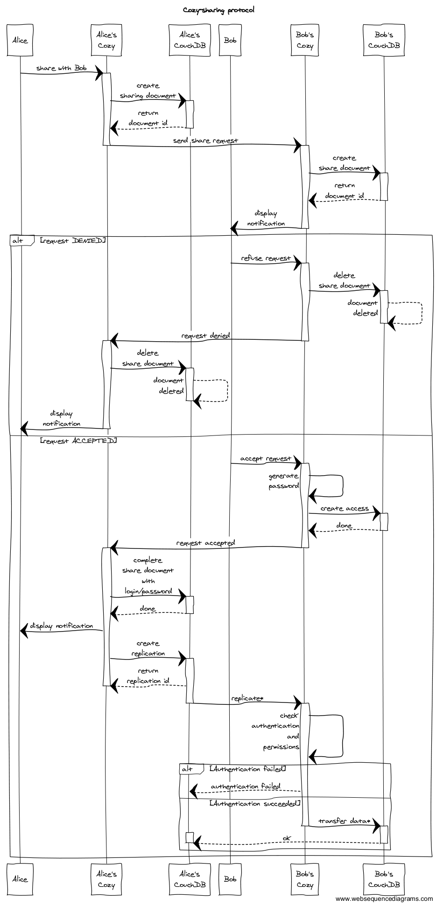

# Cozy-Sharing

*DISCLAIMER*  
As of when this documentation is being written we still are developping a way
to enable the share of documents between Cozy. That means this
documentation could be slightly out of date but we will update it as fast as
possible.

  
  

## Nomenclature

So we all *share* -- pun intended -- the same vocabulary from the beginning let
us define it before we go into details:

* **sharer**: is the user that wants to share a document with his friend
the...
* **recipient**: is the user that will receive the shared document. If you are
still following you should have guessed that he is the sharer's friend.
* **docType**: is the type of a given document. Cozy works in such a way that
every application can manage one or several type of documents. The document
types an application can manage are set through *permissions* and that is for
that same purpose that we will use it.
* **token**: you can see that as a password. It is used the same way but, in
  order to conform with the rest of the Cozy stack, we will talk about *token*.

  
  


## API

Now that we are all set let's dive into it! This first part tries to keep
things simple: in the following paragraphs we will explain why we implemented
this, what we need to make it work and then what code an application has to add
to enable this feature.


### Basics

The idea is pretty straight forward: Alice would like to share something from
her Cozy with Bob (who also happens to own a Cozy -- he is such a good friend)
but doesn't want to do it by making it publicly accessible.  A perfect solution
would be to be able to share it from one Cozy to another: ladies and gentlemen,
this is what we have done!


We have two prerequisites for this to work:

1. The **url** of the recipient's Cozy: if Alice wants to share with Bob she
   needs to know Bob's url. Just like if she wants to send a postcard to Bob
   she needs Bob's address.  

2. An actual **file** to share. Even if, on the philosophical side of things,
   the act of sharing suffices itself and does not require data to be
   meaningful we think it would be a waste of resources -- amongst all -- to
   allow it.


### The Coding [Love](http://thecodinglove.com)

Okay so you're Alice and you have a document you want to share but your
application doesn't permit such operation yet. Let's change that!

The structure on which the protocol relies is what we have called "*sharing*"
(we are no poets). This structure will be sent to the recipient and requires
the following information:

```javascript
var sharing = {
    desc: "Hey Bob this is my picture from my last holidays!",
    targets: [
        { url: "bob.hiscozycloud.com" }
    ],
    rules: [
        { id: "2zsxedcrf", docType: "picture" }
    ],
    continuous: false
};
```

> *Alice*: And what are exactly those fields?  
> *Cozy*: We've got you covered, the explanations are just below. ;-)


The fields in the sharing structure are:

* **desc**: the description of what is shared as defined by the sharer or her
  application.
* **targets**: an array containing all the url of the recipients. There may be
  more than one recipient.
* **rules**: a set of rules matching the documents shared. A rule is composed
  of the id of the document and its docType. You can have as many rules as you
  like, one for each document shared.  
  Even though the docType is not needed to precisely identify a file, it is
  however useful for security measures.
* **continuous**: a boolean telling wether or not every change the sharer makes
  on the document is propagated to the recipients.

> *Alice*: That's it?  
> *Cozy*: Yup, that's all the information you need to send. :-)

Now that you have everything it is high time to share. Here is how you could
proceed:

```javascript
var Client = require('request-json').JsonClient;

// Connect to the data-system (of the sharer)
var client = new Client("http://localhost:9101");

// Add the credentials of your application
client.setBasicAuth(process.env.NAME, process.env.TOKEN);

// Post your sharing request using your sharing structure defined above
client.post("services/sharing/", sharing, function(err, res, body) {
    if(err) {
        // handle error
    } else {
        // show must go on!
    }
});
```

> *Alice*: Credentials?  
> *Cozy*: Indeed, we don't want any application to be able to share your files.
> Your application needs to ask for the **"sharing" permission** to be able to
> share.

If you don't know how to declare the permissions your application requires,
please take a look at the corresponding documentation: [how to add
permissions](https://docs.cozy.io/en/hack/getting-started/play-with-data-system.html).
As we said in the dialogue above, to be able to share an application needs the
permission called **sharing**.

  

Here you go! You shared your document(s) to your recipient(s). Your Cozy will
handle the rest of the operations and will display a notification when your
request will be accepted or -- we sure don't hope so -- denied. :-)

  
  

## The Protocol

In the following paragraphs we will try to explain as clearly as possible what
manipulations are done, on the server side of things, on what and by who. In
short if you are not afraid to get technical, read on!

To do so we will first detail the complete structure of a sharing document,
then we will see how this document is completed, after that we will explain the
ways of access control, and finally introduce the replication which is at the
root of the sharing process.


### The complete sharing document

The document created in the previous paragraph is just a "sample" of the
complete document:

```javascript
var sharing = {
    id: "1aqwzsxed",
    docType: "sharing",
    desc: "A description of the documents",
    rules: [
        { id: "2zsxedcrf", docType: "picture" },
        { id: "3edcrfvtg", docType: "event" }
    ],
    targets: [
        { url: "bob.hiscozycloud.com", token: "token1", repID: "4rfvtgbyh" },
        { url: "charles.cozy.hk", token: "token2", repID: "5rfvtgbyh" }
    ],
    continuous: true
};
```

The new fields are:

* **id**: this is the id generated by CouchDB when the sharing document is
  created in the database.
* **docType**: the document type. Concretly it is used to manage permissions
  and as a filter when we want to retrieve documents.
* **token**: a token linked to a single share and to a unique recipient. It
  is used to authenticate the sharer and it is generated by the recipient.
* **repID**: the replication id generated by CouchDB. To share data we use the
  replication feature provided by CouchDB. This field is only useful when
  *continuous* is set to true, we will tell more on this later.


> *Alice*: Could you explain how we end up with this structure?  
> *Cozy*: It will be my pleasure!


### Raiders of the lost fields

If you recall correctly the structure the application sends to the data-system
resembles this:

```javascript
var sharing = {
    desc: "A description of the documents",
    targets: [
        { url: "bob.hiscozycloud.com" },
        { url: "charles.cozy.hk" }
    ],
    rules: [
        { id: "2zsxedcrf", docType: "picture" },
        { id: "3edcrfvtg", docType: "event" }
    ],
    continuous: true
};
```

When we receive such request we immediatly store the document in the database
for further use, and in order to do so we have to add a **docType**. This is
mandatory if we want to manage our document and the applications that can
access it.  
To sum up: CouchDB generates the **id** and the data-system automatically adds
the **docType**. We found the first two items on our list!

```javascript
    id: "1aqwzsxed",    // generated by CouchDB
    docType: "sharing", // automatically added by Cozy-sharing
```

> *Alice*: Is the id field useful besides being an identifier?  
> *Cozy*: You're right, it serves another purpose that we will explain in an
> upcoming paragraph: access control.

With those two fields set we can finally send an actual request to the targets.
A request looks like this:

```javascript
var request = {
    id: "1aqwzsxed",
    desc: "A description of the documents",
    rules: [
        { id: "2zsxedcrf", docType: "picture" },
        { id: "3edcrfvtg", docType: "event" }
    ],
    continuous: true,
    url: "alice.cozycloud.com"
};
```

As you can see we create the request by extracting only the relevant
information from the sharing document. We also do not communicate the list of
recipients, so you don't have to worry about having the url of your Cozy in the
open.  
We add the url of the sharer so that the recipient can reply -- if you happen
to use an onion router then we would not be able to tell from whom the request
came.

  

Once the recipient's Cozy receives the request, it also creates a sharing
document copying all the information received. The id is also kept but it will
be used as a login. Again we let CouchDB generate the id of newly created
documents to avoid any collision.

> *Bob*: If I understand correctly  you're creating a document on my Cozy even
> if, in the end, I decline?  
> *Cozy*: If it's the idea of storing that troubles you, imagine this a
> receiving a new e-mail. :-)

The document is generated, Cozy then waits for the approbation of its owner.
Here we have two possible scenarios: the blue one where the recipient accepts
the request and the red one where the recipient rejects it.

Let us first rapidly discuss the latter, which is the easiest. If the request
is rejected then both the sharer and the recipient delete their respective
sharing document (or only the corresponding "target" object in the sharer's
document if there are multiple targets) and that's it. The sharer is notified
and can do nothing more.

The second scenario is a bit more interesting: in order to do things properly
we have to operate a certain way.


### Accepting a request: the ways of access control

As you may have guessed if Alice shares some document with you it means she
will have an access on your Cozy. Thus it is important that with this access
she can only do what she is supposed to and nothing more.

To acheive that we first generate a unique token. This token, combined
with the id the sharer gave us, will serve as a login/token to authenticate
the transaction on the recipient's Cozy. To memorize and later on check those,
an *Access* document is created:

```javascript
var Access = {
    login: "1aqwzsxed", // the id of the sharing document of the sharer
    token: "AVeryLongAndComplicatedPassword",
    app: "7ujnik,ol", // the id of the sharing document of the recipient
    rules: [
        { id: "2zsxedcrf", docType: "picture" },
        { id: "3edcrfvtg", docType: "event" }
    ]
};
```

You don't have to know in details the meaning of this *Access* document, what
is important to note here is that we do limit the permissions to just the
shared documents. Nothing more!

With the *Access* document we found the third field on our list: **token**. One
more to go!

Now that the access control is in place the recipient's Cozy can reply to the
sharer's who can initiate the *replication*.


### Sharing is...replication, and caring

We decided to rely on CouchDB to replicate data from one CouchDB instance to
another. If you want to know more about this process you can find their
documentation [here](https://wiki.apache.org/couchdb/Replication), we will only
detail what we do in the following lines -- because that's what we know best.
;-)

So the sharer's Cozy received a positive answer to its sharing request. In that
answer there were the credentials needed to access the recipient's Cozy: the
one thing left to do is to transfer the data.

This step is pretty simple on the Cozy's side: we tell CouchDB that we want
to replicate some documents to a target, information that is in the *sharing
document*, and it handles the rest. CouchDB even returns a **replication id**
if we want to manage/monitor it, in case the replication is continuous. Indeed
if the replication is not continuous then the replication process is a one
time deal, there is no need to store it.

And we have the final piece of the puzzle: CouchDB generates the **replication
id**. Our *sharing document* is now complete and the documents are shared!

  

That's it, you know how we proceed to share documents and what information we
store in the database. Well done! :-)

  
  

## TL;DR - Can I see a diagram?

Apparently an image is worth a thousand words so if you are more confortable
with an image we even did that.

  



  

**Legend:**  
\*: this is a simplification, we did not want to burden our diagram with more
information.

## Future directions

This is the very first step for a fully decentralized sharing between Cozy owners. We plan to extend it to add new features, such as bilateral synchronisation and dynamic sharing rules evaluation, so this document will quicly evolve!

But the ultimate goal is to be able to share data with others decentralized projects, such as ownCloud, Known, or Pydio.
This is the purpose of the [Decentralized Sharing Community Group](https://www.w3.org/community/decsharing/), and we except to find a way all together to implement a true interoperable sharing.

